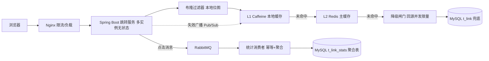

# 高性能短链接系统（Java 后端学习项目）

> 一个**从 0 到 1 演进**的短链接服务。每引入一个中间件或机制，都先用压测数据回答一个问题：
> **它解决了上一版的什么具体痛点？**
>
> 同时，它也是一次「AI Coding Agent 协作完成完整开发流程」的实践记录：
> 需求分析 → 技术方案 → 编码 → 单元测试 → 端到端故障演练 → 压测留档 → 复盘。

| 项目信息 | 值 |
|---|---|
| 语言 / 框架 | Java 17 · Spring Boot 3.2.5 · Spring MVC |
| 当前版本 | V3.5（多级缓存 + 防雪崩 + 四种可插拔发号器） |
| 单元测试 | 198 个（1 个基准测试默认跳过），`mvn -B test` |
| 压测留档 | `docs/benchmark/`（V1 / V2 / V3.5 三份报告 + JMeter 资产） |
| 开发日志 | `docs/03-开发日志.md`（逐版本的决策、踩坑、验证数据） |

---

## 目录

- [技术栈](#技术栈)
- [系统架构](#系统架构)
- [功能与接口](#功能与接口)
- [快速开始](#快速开始)
- [演进路线（V0 → V3.5）](#演进路线v0--v35)
- [压测数据](#压测数据)
- [关键设计](#关键设计)
- [踩坑清单](#踩坑清单)
- [测试](#测试)
- [文档索引](#文档索引)
- [后续路线](#后续路线)

---

## 技术栈

| 层次 | 选型 | 说明 |
|---|---|---|
| 语言 / 运行时 | JDK 17 | 当前主流 LTS |
| 框架 | Spring Boot 3.2.5 · Spring MVC | 跳转是简单请求，不引入 WebFlux 的复杂度 |
| 持久层 | MyBatis-Plus 3.5.7 + MySQL 8 | CRUD 效率高、SQL 可控，便于学习索引与慢查询 |
| 缓存 | Redis（Spring Data Redis）+ Caffeine | L2 共享缓存 + L1 进程内缓存 |
| 消息队列 | RabbitMQ | V2 引入，统计异步化与削峰 |
| 工具 | Lombok · Hutool 5.8.27 | Base62 编解码、UA/Referer 解析 |
| 接口文档 | Knife4j 4.4.0（springdoc） | 启动后访问 `http://localhost:8080/doc.html` |
| 压测 | Apache JMeter 5.6.3 | 脚本与结果见 `docs/benchmark/` |

> **未引入 Redisson**：布隆过滤器与分布式重建锁都用「Spring Data Redis + 手写算法」实现。
> 学习项目刻意手写一遍原理（位图/双重哈希/SETNX），Redisson 作为后续可选替代保留。
>
> **没有额外的 profile 文件**：压测与故障演练全部通过「配置开关 + 启动参数覆盖」完成
> （例如 `--shortlink.cache.enabled=false --shortlink.stats-enabled=false` 复现 V0 基线），
> 这样同一份构建产物就能复现所有历史版本的对照实验。

---

## 系统架构



**跳转读链路（核心路径）**，全部失败点都有明确降级：

```
布隆过滤器（本地内存位图，零 Redis 往返；判定"不存在"才回查确认）
  → L1 Caffeine（热点短码不出进程）
    → L2 Redis（命中则回填 L1；逻辑过期则返回旧值 + 异步重建）
      → 互斥重建（只放一个请求回源，其余跟车等待）
        → 降级闸门（缓存层故障时限制回源并发，超限快速返回 503）
          → MySQL（唯一数据源）
```

**写链路**：创建 → 发号器 → 落库（唯一索引兜底 + 冲突自愈重试）→ 写布隆过滤器 → 删两级缓存 + 广播失效。
统计写入与跳转完全解耦（经 MQ 异步 → 消费端幂等聚合 → 定时批量落库）。

---

## 功能与接口

| 方法 | 路径 | 说明 |
|---|---|---|
| POST | `/api/v1/link/create` | 创建短链（可选分组 / 描述 / 自定义有效期） |
| PUT | `/api/v1/link/update` | 修改短链（改 URL / 停用 / 改有效期） |
| DELETE | `/api/v1/link/del?id=` | 逻辑删除 |
| POST | `/api/v1/link/page` | 分页查询（按分组、状态筛选） |
| POST | `/api/v1/group/create` | 创建分组 |
| GET | `/api/v1/group/list` | 查询全部分组 |
| DELETE | `/api/v1/group/del?gid=` | 删除分组 |
| GET | `/{code}` | **302 跳转（核心读链路）** |
| GET | `/api/v1/stats/{code}?date=` | 查询某短链某日的 PV/UV/IP + 来源/设备分布 |
| GET | `/doc.html` | Knife4j 接口文档（含各请求/响应示例） |

> 写接口（create / update / del）按客户端 IP 做**滑动窗口限流**，超限返回 **429**；
> 跳转链路是核心读服务，不参与限流，改由**降级闸门**保护 DB。

---

## 快速开始

**前置依赖**：JDK 17、MySQL 8、Redis（RabbitMQ 可选，`shortlink.mq.enabled=false` 时退化为同步统计）。

```bash
# 1. 建库建表（含 t_link / t_link_stats / t_group / t_user / t_sequence / t_segment）
mysql -uroot -p < src/main/resources/sql/schema.sql

# 2. 配置连接信息（DB / Redis / RabbitMQ 凭据，不要提交到 Git）
#    编辑 src/main/resources/application-dev.yml

# 3. 构建（会跑全部单元测试）
mvn -B clean package

# 4. 启动
java -jar target/short-link-0.1.0-SNAPSHOT.jar

# 5. 冒烟：创建短链 → 跳转
curl -X POST http://localhost:8080/api/v1/link/create \
     -H "Content-Type: application/json" \
     -d '{"originalUrl":"https://www.baidu.com","validType":1}'
curl -i http://localhost:8080/<返回的 code>     # 期望 302 + Location
```

常用切换参数（全部可用命令行覆盖，便于做对照实验）：

```bash
# 切换发号器：auto(DB自增) / redis / segment(号段) / snowflake(雪花)
java -jar target/short-link-0.1.0-SNAPSHOT.jar --shortlink.id-generator-type=segment

# 复现 V0 基线（关缓存 + 关统计）
java -jar target/short-link-0.1.0-SNAPSHOT.jar --shortlink.cache.enabled=false --shortlink.stats-enabled=false

# 缓存层故障演练（限流 + 降级闸门收紧，模拟 Redis 不可用时的保护效果）
java -jar target/short-link-0.1.0-SNAPSHOT.jar \
  --shortlink.cache.degradation.max-concurrent-db-queries=1 \
  --shortlink.cache.degradation.acquire-timeout-millis=1
```

---

## 演进路线（V0 → V3.5）

| 版本 | 主题 | 引入的东西 | 解决的痛点 | 关键结论（详见压测报告） |
|---|---|---|---|---|
| **V0** | 最小闭环 | DB 自增发号 + Base62 短码 + 302 跳转 + CRUD/分组/过期停用校验 | — | 建立可运行基线 |
| **V1.1** | Redis 缓存 | Cache Aside + TTL 随机抖动 | 每次跳转都查 DB，连接池排队严重 | QPS **3443 → 5369（+56%）**，p99 **187ms → 47ms（-75%）** |
| **V1.2** | Redis 发号 | `INCR` + DB 最大值播种 + 丢号自愈 | DB 自增发号每次写库 | 发号脱离 DB（0.16ms → 见 V3.5 对比） |
| **V1.3** | 同步统计 | PV（INCR）+ UV/IP（PFADD） | 需要有访问数据 | **代价巨大**：加统计后 QPS 回落到 3439（**-36%**）→ V2 的直接动机 |
| **V2** | 统计异步化 | RabbitMQ + 消费端幂等聚合 + 定时批量落库 + 死信队列 | 同步统计把跳转延迟吃掉 | 100 线程 QPS **2873 → 3672（+28%）**、avg **-25%**；压测结束队列积压 1.6 万条而**跳转不受影响**（削峰填谷） |
| **V3.1** | 防穿透 | 布隆过滤器（初版：Redis 位图） | 空值缓存被扫描时产生大量一次性 key | 扫描流量在缓存之前就被拦截 |
| **V3.2** | 防击穿 | 逻辑过期 + 异步重建 + 互斥重建（SETNX） | 热点短码缓存失效瞬间并发打穿 DB | 逻辑过期后返回旧值**不查库**；互斥重建只放一个回源 |
| **V3.3** | 防雪崩 + 多级缓存 | L1 Caffeine + 失效广播 + 降级闸门 + 写接口限流 | Redis 故障时全部流量砸向 DB；热点 key 打满单分片 | Redis 连接全杀后 L1 仍 **302 / 48ms**；降级演练 40 并发 **503=27**（DB 被保护） |
| **V3.4** | 性能修复 | 布隆过滤器改**本地位图** + 缺失回查 | 旧实现每请求 7 次 `GETBIT`，把 L1 彻底架空 | Redis `PAUSE 3s` 场景请求耗时 **3063ms → 36ms** |
| **V3.5** | 发号器对比 | 号段模式（双 buffer）+ Snowflake（时钟回拨处理） | 发号方案与 ID 形态的取舍需要数据支撑 | 号段每号 **7µs**（含 DB 分配摊销）vs Redis INCR **158µs** vs DB 自增 **1393µs** |

---

## 压测数据

完整报告与原始数据（JTL/日志/JMeter 脚本）见 **[`docs/benchmark/`](docs/benchmark/)**。

### 1. 缓存与统计的收益/代价（V1，100 线程 × 20000 请求）

| 场景 | 缓存 | 统计 | QPS | avg | p95 | p99 |
|---|---|---|---|---|---|---|
| S1 V0 等价基线 | ✗ | ✗ | 3442.9 | 25.01ms | 86ms | 187ms |
| S2 仅缓存 | ✓ | ✗ | **5369.1** | **15.70ms** | **30ms** | **47ms** |
| S3 V1 现状（同步统计） | ✓ | ✓ | 3438.8 | 26.57ms | 47ms | 60ms |
| S4 仅统计 | ✗ | ✓ | 2488.5 | 37.54ms | 58ms | 97ms |

结论：**缓存让长尾大幅收敛（p99 -75%），而同步统计把收益几乎全部吃掉**——这就是引入 MQ 的量化依据。

### 2. MQ 异步化的收益（V2）

| 线程数 | 场景 | QPS | avg | 变化 |
|---|---|---|---|---|
| 100 | V1 同步统计 | 2872.7 | 32.34ms | — |
| 100 | **V2 MQ 异步** | **3672.4** | **24.33ms** | **+28% / -25%** |
| 200 | V1 同步统计 | 2752.9 | 68.91ms | — |
| 200 | V2 MQ 异步 | 3076.4 | 58.51ms | +12% / -15% |

诚实说明：**未达 V1 报告设定的 5000+ 验收目标**。原因是压测客户端/DB/Redis/Broker 全在本机 16 核上争抢 CPU（S3 从 100 加到 200 线程吞吐不增、延迟翻倍，是典型的环境饱和特征），不是架构问题。

### 3. 发号器横向对比（V3.5，单线程每号耗时）

| 方案 | 每号耗时 | 说明 |
|---|---:|---|
| 号段（内存发号） | **0.29 µs** | 纯本地原子自增 |
| 雪花（本地生成） | **0.34 µs** | 受 4096/ms 上限约束 |
| 号段（含真实 DB 分配，step=1000 摊销） | **7.16 µs** | 一次分配约 7ms，按 step 摊销 |
| Redis INCR（每号一次 RTT） | **158 µs** | 22× |
| DB 自增（每号一次 INSERT） | **1393 µs** | 195× |

推荐：**短链短码优先号段**（实测短码 2 位 vs 雪花 10 位），雪花更适合订单号这类"不需要短"的场景。

### 4. 高并发防护的故障演练（V3.3 / V3.4）

| 场景 | 构造方式 | 结果 |
|---|---|---|
| L1 命中不依赖 Redis | 预热后 `CLIENT KILL` 杀掉应用全部 Redis 连接 | 仍 **302 / 48ms** ✓ |
| 两级缓存一致性 | 通过 API 改 URL 后立即请求 | 立即返回**新 URL** ✓ |
| 降级闸门保护 DB | `CLIENT PAUSE 8000` + 40 个真齐发请求 | **302=13 / 503=27**，日志拒绝数 27 与 503 完全一致 ✓ |
| 写接口限流 | 阈值 5 次/分钟连续创建 | 第 6 次写请求 **429** ✓ |
| 布隆过滤器本地位图 | 热短码 + Redis `PAUSE 3s` | **3063ms → 36ms** ✓ |
| 多实例快照过期自愈 | 实例#2 建码 → 实例#1 请求 | **302（不是 404）**，日志「本地快照过期→放行+重载 ×1」✓ |

---

## 关键设计

**1. 发号器可插拔（本项目核心学习内容）**

统一 `IdGenerator` 接口 + Base62 编码层，四种实现靠 `shortlink.id-generator-type` 一行切换：

| 实现 | 原理 | 取舍 |
|---|---|---|
| `AutoIncrementIdGenerator` | `t_sequence` 自增 + `RETURN_GENERATED_KEYS` | 最简；每号一次 DB 写，单库写上限 |
| `RedisIncrIdGenerator` | `INCR` + 启动按 DB 最大值播种 + 计数被清空时自愈 | 每号一次 RTT；Redis 故障即停 |
| `SegmentIdGenerator` | `t_segment` 一次领一段（默认 1000）放内存发，**双 buffer 异步预取** | 发号 DB 调用降为 1/step；号有段间跳变、重启浪费存量 |
| `SnowflakeIdGenerator` | 41 位时间戳 + 10 位 workerId + 12 位序列号 | 零依赖、性能最高；**短码更长**，需处理时钟回拨与机器 ID |

**2. 缓存一致性策略**
- Cache Aside：改/删时**先清 L1 → 再删 L2 → 广播其他实例清 L1**（顺序与失败兜底都写在注释里）
- 缓存定位为「性能加速层而非数据源」：可全量丢失并从 DB 重建
- L1 TTL（30s）远小于 L2（1800s+抖动）：广播丢失时不一致最多存活一个 L1 TTL
- 兼容存量缓存：逻辑过期字段缺失一律视为未过期（避免升级瞬间触发全量刷新）

**3. 防穿透 / 防击穿 / 防雪崩三件套**

| 问题 | 手段 | 关键取舍 |
|---|---|---|
| 穿透（查不存在的数据） | 布隆过滤器**本地位图** → 空值缓存兜底 | 本地判定"不存在"时回查 Redis 确认，避免多实例误拦成 404（fail-close） |
| 击穿（热点 key 失效） | 逻辑过期返回旧值 + 异步重建；互斥重建兜底 | 跳转场景"稍旧"几乎无害，**绝不让用户等锁** |
| 雪崩（大量 key 同时失效 / 依赖故障） | TTL 随机抖动 + L1 多级缓存 + 降级闸门 + 写接口限流 | 缓存层故障时宁可 503 一部分，也要保住 DB |

**4. 降级闸门用 `Permit extends AutoCloseable`**：正常态返回空许可、降级态返回真实许可，调用方统一 try-with-resources 释放，从 API 层面杜绝许可泄漏。

**5. 限流器刻意不依赖 Redis**：进程内滑动窗口。若用 Redis 限流，Redis 故障时"限流器"和"被保护的下游"会一起失效——在最需要保护的时候失去保护。代价是多实例下阈值是"每实例"值（已在类注释写明）。

**6. 短码必须区分大小写**：Base62 字符集同时含 `a-z` 与 `A-Z`，DB 列必须显式 `COLLATE utf8mb4_bin`（详见踩坑清单第 1 条）。

---

## 踩坑清单

> 完整版（含现象、排查过程、修法）在 [`docs/03-开发日志.md`](docs/03-开发日志.md)，这里是精华。

### 数据库

1. **MySQL 排序规则毁掉一半短码空间（真实生产级缺陷）**：`code` 列用默认的 `utf8mb4_general_ci`（大小写不敏感），`"2A"` 被判为与已存在的 `"2a"` 重复 → 30 并发创建出现 23~26 次重复键错误、id 空间大量空洞；更隐蔽的是 `WHERE code='2A'` 会命中 `2a` 的记录（`/2A` 与 `/2a` 指向同一条短链）。被"冲突→自愈→重试"掩盖成"偶发冲突"。**修法**：`COLLATE utf8mb4_bin`，实测冲突 23 → 0。
2. **affected-rows 是"实际改变的行数"**：用 `UPDATE t SET c = c` 探测行是否存在，行存在也返回 0 → 逻辑永远判"不存在"。**修法**：改用 `SELECT COUNT(1)` 只读探测。

### 发号器

3. **本地缓冲起点必须与 DB 对齐**：号段模式若只把 `t_segment.max_id` 抬到 `MAX(t_link.id)`、而本地 `cursor` 仍从 0 开始，首段会覆盖已用过的号。
4. **同库混用发号器会让 id 空间前跳**：雪花产生的 `3.65e17` 级 id 会抬高 `MAX(t_link.id)`，切回号段后短码直接从 2 位变 10 位。规范：**同一 id 空间同一时刻只启用一种发号器**。
5. **雪花纪元必须校验**：`epoch-millis` 晚于当前时间会让 ID 为负，报错现象是"创建接口 500"，与真实原因相距甚远 → 启动即拒绝。
6. **时钟回拨**：小幅（≤ 阈值）自旋等待追上；大幅**直接拒绝发号**——重复 ID 会以"偶发创建失败"的形式出现，比明确报错难排查得多。

### 缓存 / 并发

7. **异常边界要贴住故障点**：`catch (Exception)` 包得过大，会把"刷新触发"的异常误判成"Redis 故障"，导致多查一次 DB（被单元测试抓出）。
8. **线程池拒绝策略与调用方约定必须一致**：`DiscardPolicy` 静默丢弃 → 调用方的 `catch (RejectedExecutionException)` 成死代码、"在飞标记"泄漏 → 该短码永久无法刷新。**根因是单测注入了自己写的 executor，测试桩与生产实现不一致**。
9. **性能优化可能把上层收益架空**：布隆过滤器每请求 7 次 `GETBIT`，即使命中 L1 也要 7 个 RTT（`PAUSE 3s` 实测请求被拖到 3063ms）。**修法**：位图整块加载进本进程内存。
10. **本地位图会过期**：多实例下"本地判定不存在"必须回查 Redis 确认，否则会把其他实例刚创建的短码误拦成 404。

### 工程 / E2E（最容易骗到自己的部分）

11. **E2E 首轮结果必须交叉验证**：PowerShell 向原生命令传参会剥离 JSON 双引号，`redis-cli SET` 写入非法 JSON，导致"逻辑过期"验证实际测的是"损坏值回源"分支。
12. **改了代码要重新 `package`**：跑 E2E 时忘了打包，用的是旧 jar，于是一连串"新功能没生效"的假象。
13. **并发验证要保证请求真齐发**：`curl --parallel` 确实并发，但 40 个请求的发出时刻错开约 2ms，而本机回源只要 3ms → 锁窗口不重叠，"跟车"一次都不发生（换 .NET `HttpClient` 一次性 `GetAsync` 才稳定复现）。
14. **`CLIENT PAUSE` 是"变慢"不是"故障"**：命令只是排队，暂停结束照样成功；要构造持续故障窗口，暂停时长必须明显大于客户端命令超时（2s）。
15. **日志 logger 名会被缩写**：Spring Boot 默认把超过 40 字符的 logger 名缩成 `c.s.service.impl.RedirectServiceImpl`，按包名 grep 会漏行 → 按类名匹配。
16. **测试桩的两个经典坑**：Mockito 给 varargs 方法打桩要用 `any(Object[].class)`；`invocation.getArgument(1)` 会被编译器推断成 `Long` 而在运行期抛 `ClassCastException`。
17. **`ApplicationContextRunner.withBean()` 也会求值 `@ConditionalOnProperty`**：注册带条件注解的 Bean 时必须提供开关属性值。
18. **装配问题单元测试测不出来**：`SlidingWindowRateLimiter` 有两个构造器且未标 `@Autowired`，Spring 去找默认构造器 → **应用启动直接失败**，而当时 163 个单测全绿。**修法**：`BeanWiringTest` 用 `ApplicationContextRunner` 让 Spring 真正实例化组件，把这类问题挡在提交前。

---

## 测试

```bash
mvn -B test                       # 198 个测试（1 个基准测试默认跳过）
```

覆盖重点：

| 方向 | 代表用例 |
|---|---|
| 编码 | Base62 往返、边界值 |
| 发号器 | 四种实现的并发唯一性（如号段 8 线程 × 500 号无重复）、号段预取/切换/自愈、雪花时钟回拨两种处理与序列号进位 |
| 跳转 | 不存在 / 停用 / 过期三分支、逻辑过期返回旧值、互斥重建 leader/follower/超时、L1+L2 填充分支 |
| 缓存 | Cache Aside 失效、异步刷新去重与拒绝、失效广播 |
| 防护 | 降级闸门许可归还、滑动窗口限流阈值与并发安全、布隆过滤器 fail-open 与快照过期自愈 |
| 装配 | `BeanWiringTest`（8 例）：Spring 能否实例化关键组件 + 线程池拒绝策略断言 |

按需运行的基准测试（**注意：会改写开发库的发号状态**，详见报告开头提示）：

```bash
mvn -B test "-Dtest=IdGeneratorBenchmarkTest" "-Dshortlink.benchmark=true"
```

---

## 文档索引

| 文档 | 内容 |
|---|---|
| [`docs/01-需求分析与技术方案.md`](docs/01-需求分析与技术方案.md) | 业务流程、表设计、发号方案对比、Redis 场景、缓存三大问题、MQ 取舍、瓶颈与分库分表分析、整体架构、技术栈、V0→V4 路线 |
| [`docs/02-数据库设计.md`](docs/02-数据库设计.md) | 表结构、索引、"为什么不用外键"、短码排序规则说明 |
| [`docs/03-开发日志.md`](docs/03-开发日志.md) | **逐版本的做了什么 / 关键决策 / 踩坑 / 验证数据**（信息量最大） |
| [`docs/benchmark/`](docs/benchmark/) | V1 / V2 / V3.5 压测报告 + JMeter 脚本与原始结果 |

---

## 后续路线

| 优先 | 事项 | 说明 |
|---|---|---|
| 高 | 分库分表（ShardingSphere-JDBC） | 按 id 哈希路由，练习分片键选择与跨片查询代价 |
| 高 | 统计查询补历史 + PV/UV 趋势接口 | 读 MySQL 快照，补齐 V2 遗留 |
| 中 | 诊断接口 | L1 命中率 / 降级拒绝数 / 限流拒绝数目前只在内存里，缺出口 |
| 中 | `@SpringBootTest` 集成测试 | 跳转 L1+L2+DB 全链路目前仅靠 E2E 覆盖 |
| 中 | 布隆过滤器预热与并发新增的覆盖窗口 | 需在"批量 SETBIT 合并"与分布式锁之间做取舍 |
| 低 | 多域名路由 / CDN 边缘跳转 / 多租户 | 需求出现时再做 |
